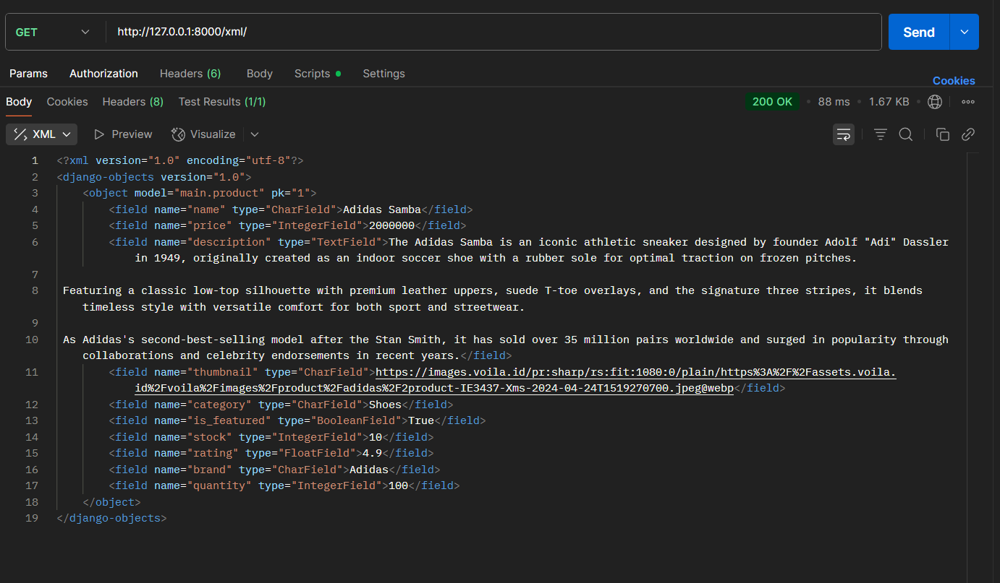
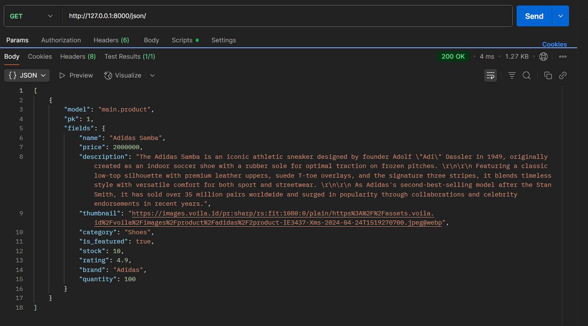
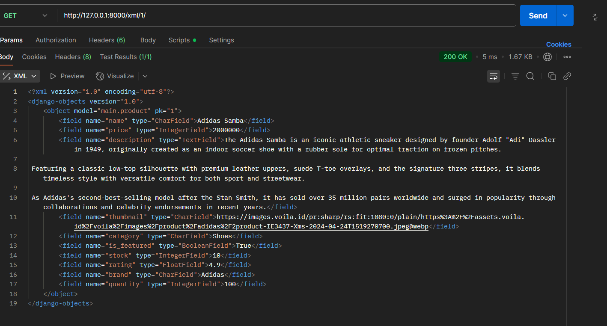
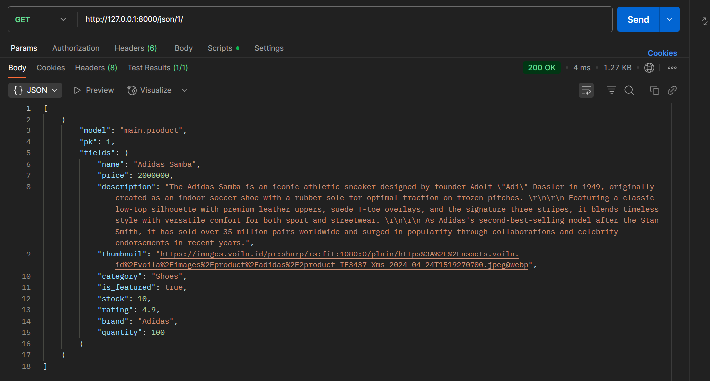

Link Toko Sofita : https://ahsan-parvez-tokosofita.pbp.cs.ui.ac.id/

## **Penjelasan Checklist**
**Checklist 1**
- > Start yang dimana dilakukan dengan langkah meenyiapkan hal hal yang dibutuhkan seperti env dengan menstup env kemudian melakukan setup di settings.py dan juga mencoba me run server django
1. Persiapan Proyek Django
    1. Buat direktori baru untuk proyek: 
        buat direktori baru dengan nama Toko Sofita
    2. Buka terminal di dalam VSCode kemudian jalankan Command
        python -m venv env
        env\Scripts\activate
    3. Buat file requirements.txt berisi dependency utama yang berisi:
        django
        gunicorn
        whitenoise
        psycopg2-binary
        requests
        urllib3
        python-dotenv
    4. Lalu install dengan cara (jika belum)
        pip install -r requirements.txt
    

2. Setup Proyek Django
    1. Buat proyek Django:
        django-admin startproject toko_sofita .
    2. Buat file .env (development):
        PRODUCTION=False
       Buat juga file .env.prod:
        DB_NAME=<nama database>
        DB_HOST=<host database>
        DB_PORT=<port database>
        DB_USER=<username database>
        DB_PASSWORD=<password database>
        SCHEMA=tugas_individu
        PRODUCTION=True
    3. Edit settings.py:
        Tambahkan:
            import os
            from dotenv import load_dotenv
            load_dotenv()
       Set ALLOWED_HOSTS awalnya ke:
        ALLOWED_HOSTS = ["localhost", "127.0.0.1"] // awal awal
       Tambahkan flag production:
        PRODUCTION = os.getenv('PRODUCTION', 'False').lower() == 'true'

3. Jalankan Server Lokal
    1. Migrasi database:
        python manage.py migrate
    2. Jalankan server:
        python manage.py runserver
        Pastikan django berjalan normal sebelum lanjut ke github atau PWS

4. Setup Github
    1. Inisialisasi Git:
        git init
    2. Tambahkan .gitignore (untuk menghindari commit file sensitif/env/db).
    3. Hubungkan ke repository GitHub:
        git remote add origin https://github.com/ahsanparvezz/toko-sofita.git
        git branch -M master
    4. Commit dan push
        git add .
        git commit -m "Commit awal untuk django"
        git push origin master

5. Deploy ke PWS
    1. Buat project baru di PWS → simpan username/password credential.
    2. Update ALLOWED_HOSTS di settings.py:
        ALLOWED_HOSTS = ["localhost", "127.0.0.1", "ahsan-parvez-tokosofita.pbp.cs.ui.ac.id"]
    3. Hubungkan repo ke PWS:
        git remote add pws https://pbp.cs.ui.ac.id/ahsan.parvez/tokosofita
        git branch -M master
        git push pws master
        → Saat push, masukkan username/password PWS.

**Checklist 2**
- > membuat main dengan python manage.py startapp main lalu menambahkannya kedalam installed apps dan menambahkan folder templates untuk menyimpan file html
6. Membuat Aplikasi main
    1. Buat app baru:
        python manage.py startapp main
    2. Tambahkan 'main' ke INSTALLED_APPS di settings.py.
    3. Buat folder templates dalam app main untuk menyimpan file HTML.

**Checklist 3**
- > Routing URL untuk aplikasi main
7. Routing
    1. Routing utama (urls.py di toko_sofita):
        from django.urls import path, include

        urlpatterns = [
            path('', include('main.urls')),
        ]

**Checklist 4**
- > membuat model yang diperlukan di models.py dengan menambahkan atribut wajib dan juga atribut tambahan
8. Di models.py app main:
    class Product(models.Model):
    name = models.CharField(max_length=255)
    price = models.IntegerField()
    description = models.TextField()
    thumbnail = models.URLField()
    category = models.CharField(max_length=100)
    is_featured = models.BooleanField(default=False)
    stock = models.IntegerField(default=0)
    rating = models.FloatField(null=True, blank=True)
    brand = models.CharField(max_length=100, blank=True)
    quantity = models.IntegerField(default=0)

    def __str__(self):
        return self.name

**Checklist 5**
- > membuat funciton untuk digunakan ke template main html yang berisi nama app, nama, dan kelas
9. Views (views.py):
        from django.shortcuts import render
        def show_main(request):
            context = {
                'app_name': 'Toko Sofita',
                'name': 'Ahsan Parvez',
                'class': 'PBP E',
            }
            return render(request, "main.html", context)

**Checklist 6**
- > mengatur routing url pada proyek di folder main
10. URLs app (urls.py di folder main):
    from django.urls import path
    from main.views import show_main

    app_name = 'main'

    urlpatterns = [
        path('', show_main, name='show_main'),
    ]

**Checklist 7**
- > melakukan deployment ke pws
11. Deployment
    git add .
    git commit -m "Add main app with Product model and routing"
    git push origin master
    git push pws master

## **Link Bagan**
https://drive.google.com/file/d/1TS_KleMlmTl0XTZwwVW1RCUE4QC2tyK5/view?usp=sharing

## **Peran settings.py pada Django**
settings.py itu bisa dibilang pusat konfigurasi dari proyek Django. Semua pengaturan penting ada di sana, mulai dari database yang dipakai, daftar aplikasi yang aktif, konfigurasi keamanan (kayak secret key, debug mode, allowed hosts), sampai pengaturan static file dan template. Jadi, kalau kita mau ngubah perilaku proyek Django, biasanya yang pertama kali diutak-atik ya file settings.py ini.

## **Cara kerja migrasi database di Django**
Migrasi di Django itu intinya cara buat nyamain struktur database dengan model yang kita definisikan di kode.

Prosesnya:

Waktu kita bikin atau ubah model di models.py, Django belum otomatis ubah database.

Kita jalankan python manage.py makemigrations, Django akan bikin file migrasi yang isinya instruksi perubahan (misalnya bikin tabel baru, nambah kolom, atau hapus kolom).

Lalu pakai python manage.py migrate, instruksi itu dijalankan ke database, jadi database bener-bener punya struktur yang sama kayak model di kode.

Jadi singkatnya: makemigrations = bikin rencana, migrate = eksekusi rencana ke database.

## **Kenapa Django?**
Menurut saya, Django dipilih menjadi permulaan adalah karena Django udah kayak pake all in one hampir komplit dan ramah buat pemula. Dibangun diatas python yang notabennya mudah dimengerti. Dokumentasinya juga lengkap, komunitasnya besar dan banyak dipakai di industri. Jadi cukup relevan juga di praktik real world

## **Feedback**
Untuk feedback dari saya, tutorialnya sudah cukup bagus, lengkap dan mudah dimengerti. Mungkin tambahan dari saya, tambahkan saran aktivasi auto save karena saya dan teman2 saya lebih dari sekali error karena autosave tidak on.

## Tugas 3
1.  Jelaskan mengapa kita memerlukan data delivery dalam pengimplementasian sebuah platform?
    Karena kita memerlukan data delivery agar data yang ada di platform bisa disajikan ke pengguna atau sistem lain secara aman, tepat waktu, dan dalam format yang sesuai, sehingga data bisa benar-benar dimanfaatkan untuk keputusan, integrasi, dan pengalaman pengguna.

2. Menurutmu, mana yang lebih baik antara XML dan JSON? Mengapa JSON lebih populer dibandingkan XML?
    JSON lebih populer dibandingkan XML karena lebih ringan, mudah dibaca, cepat diproses, dan langsung cocok dengan web/API modern. Sedangkan XML lebih berat karena banyak tag dan biasanya dipakai di sistem lama atau dokumen kompleks.

3.  Jelaskan fungsi dari method is_valid() pada form Django dan mengapa kita membutuhkan method tersebut?
    is_valid() pada form Django berfungsi untuk memeriksa apakah data input sudah sesuai aturan validasi. Kita membutuhkannya agar hanya data yang benar dan bersih yang diproses atau disimpan ke database.

4. Mengapa kita membutuhkan csrf_token saat membuat form di Django? Apa yang dapat terjadi jika kita tidak menambahkan csrf_token pada form     Django? Bagaimana hal tersebut dapat dimanfaatkan oleh penyerang?
    csrf_token dibutuhkan di Django untuk melindungi form dari serangan Cross-Site Request Forgery (CSRF), csrf_token dibutuhkan untuk mencegah serangan CSRF. Tanpa token, penyerang bisa memalsukan form agar user melakukan aksi berbahaya tanpa disadari. Token ini memastikan bahwa request yang dikirim benar-benar berasal dari user yang sah, bukan dari pihak luar.

    Jika tidak ditambahkan, penyerang bisa membuat form palsu di luar aplikasi lalu memancing user yang sedang login untuk mengirim request berbahaya, misalnya mengubah data, mengganti password, atau melakukan transaksi tanpa sepengetahuan user. Dengan adanya csrf_token, request palsu tersebut akan ditolak karena tidak memiliki token yang valid.

5. Jelaskan bagaimana cara kamu mengimplementasikan checklist di atas secara step-by-step (bukan hanya sekadar mengikuti tutorial).
    **Checklist 1**
    Tambahkan 4 fungsi views baru untuk melihat objek yang sudah ditambahkan dalam format XML, JSON, XML by ID, dan JSON by ID.

    Membuka views.py pada app main.

    Menambahkan import yang dibutuhkan (HttpResponse, serializers, dan model Product).

    Membuat fungsi baru:

    show_xml → menampilkan semua data dalam format XML.

    show_json → menampilkan semua data dalam format JSON.

    show_xml_by_id → menampilkan data berdasarkan ID dalam format XML.

    show_json_by_id → menampilkan data berdasarkan ID dalam format JSON.

    **Checklist 2**
    Membuat routing URL untuk masing-masing views yang telah ditambahkan pada poin 1.

    Membuka urls.py pada app main.

    Menambahkan path untuk:

    /xml/ → menuju fungsi show_xml.

    /json/ → menuju fungsi show_json.

    /xml/<int:id>/ → menuju fungsi show_xml_by_id.

    /json/<int:id>/ → menuju fungsi show_json_by_id.

    **Checklist 3**
    Membuat halaman yang menampilkan data objek model.

    Halaman daftar produk (main.html) menampilkan semua data produk.

    Terdapat tombol "Add" untuk redirect ke halaman form input produk.

    Terdapat tombol "Detail" di setiap produk untuk membuka halaman detail produk.

    **Checklist 4**
    Membuat halaman form untuk menambahkan objek model.

    File yang digunakan: create_product.html.

    Form ini terhubung dengan forms.py dan fungsi create_product pada views.py.

    Tombol Add di main.html akan mengarahkan ke halaman create_product.html.

    **Checklist 5**
    Membuat halaman yang menampilkan detail dari setiap data objek model.

    File yang digunakan: product_detail.html.

    Halaman ini menampilkan detail lengkap dari satu produk.

    Tombol Detail di main.html mengarahkan ke halaman product_detail.html berdasarkan ID produk.

6. Apakah ada feedback untuk asdos di tutorial 2 yang sudah kalian kerjakan?
    Untuk tutorial 2 sudah cukup baik, tapi saya lihat lihat masih belum ada reminder untuk menyalakan auto save atau men save file tiap 5 menit misalnnya, mungkin itu saja.

7. Mengakses keempat URL di poin 2 menggunakan Postman, membuat screenshot dari hasil akses URL pada Postman, dan menambahkannya ke dalam README.md.
###  Data XML

###  Data JSON

### XML by ID

### JSON by ID

